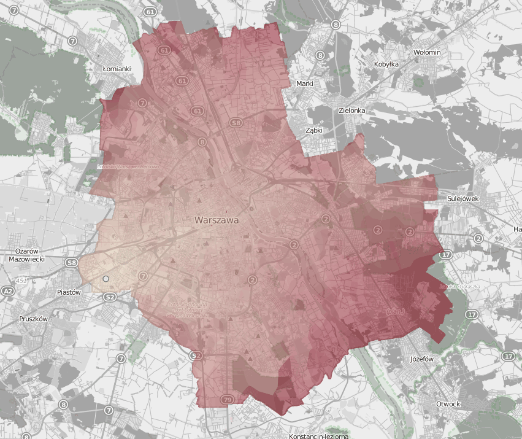

### Showcase: [sdadas.github.io/warsaw-transport/](https://sdadas.github.io/warsaw-transport/)

## Warsaw Transport

A visualization of Warsaw public transport. 
Data generation and preprocessing done in Python. 
Frontend done using TypeScript and Leaflet.js.

Mapa pozwala na wizualizację dla określonego dnia oraz godziny, czasu dojazdu komunikacją miejską z wybranego punktu startowego do pozostałych części miasta.
Wizualizacja opiera się na [danych rozkładowych](http://www.ztm.waw.pl/?c=628) udostępnianych przez ZTM i uwzględnia autobusy, tramwaje oraz pociągi metra (nie uwzględnione w oryginalnych danych).

Czasy przejazdu do każdego punktu wyliczane są z grafu połączeń pomiędzy przystankami po stronie klienta i rzutowane na warstwę będącą pokolorowanym diagramem voronoia z lokalizacjami przystanków.

